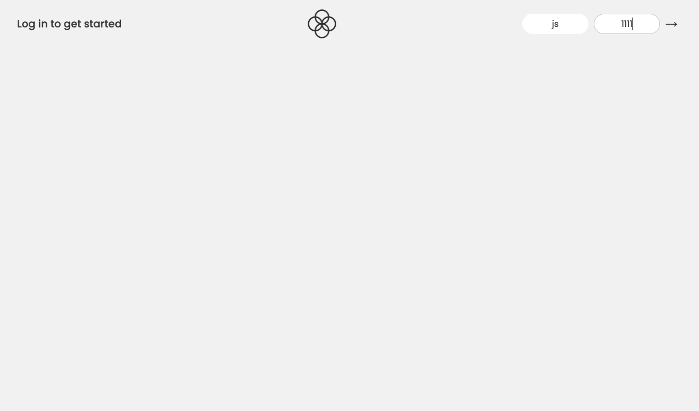
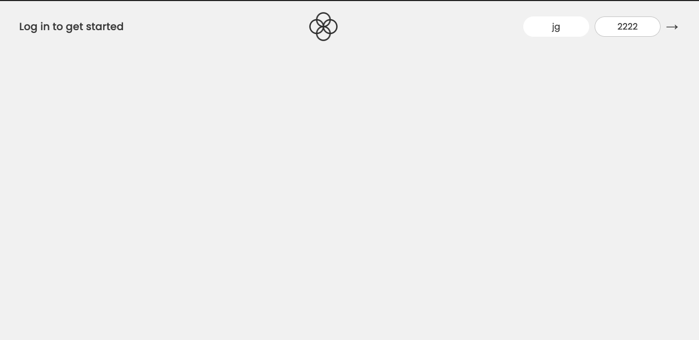
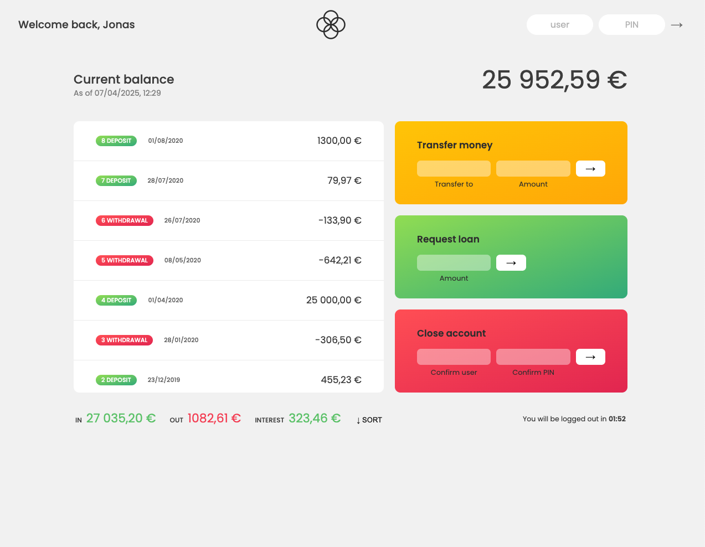
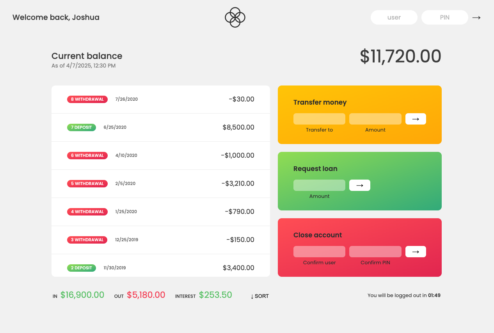

# Bankist App

## Description

In the Bankist App, the primary focus was on using JavaScript to manipulate the HTML/UI and CSS. This allowed the display of banking data for users who were logged into their accounts while hiding it for those who were not. Additionally, a basic system for transferring and receiving funds was created, which updates both accounts involved in the transaction. The app displays the currency of the logged-in account, interest rates, and summaries. A logout timer was also implemented to automatically log out users after a set period. Despite being a simple app, it taught me a lot about basic authentication, helping me understand more advanced levels. It also provided insights into various methods for updating and manipulating the UI using JavaScript, with a significant focus on DOM manipulation and Event handling. Of course there is many other things that I've learnt and focused on in this project, like working with arrays, numbers, dates, timers etc., but of course this would be a book if I named them all with everything that I have learnt in this project!

## Link
[Bankist App](https://garciajv86.github.io/Bankist-App/)

## ScreenShot

## Table of Contents

- [Installation](#installation)
- [Usage](#usage)
- [License](#license)
- [Credits](#credits)
- [Questions](#questions)

## Installation

No Installation needed!

## Usage

To use the app and explore its features, log in with the following credentials:

- Username: js, PIN: 1111
- Username: jg, PIN: 2222

Once logged in, you can enjoy all the functionalities of the app! To transfer funds, simply enter the username of the account you wish to transfer funds to and watch the magic happen. You can also sort withdrawals and deposits by clicking the sort button at the bottom. Additionally, you can request a loan or even close your account.

## License

This project is licensed under the [MIT](https://choosealicense.com/licenses/mit/) license.

## Credits

- Joshua V. Garcia
- [My GitHub Profile](https://github.com/garciajv86)

- Jonas Schmedtman

## Questions

- [My GitHub Profile](https://github.com/garciajv86)
